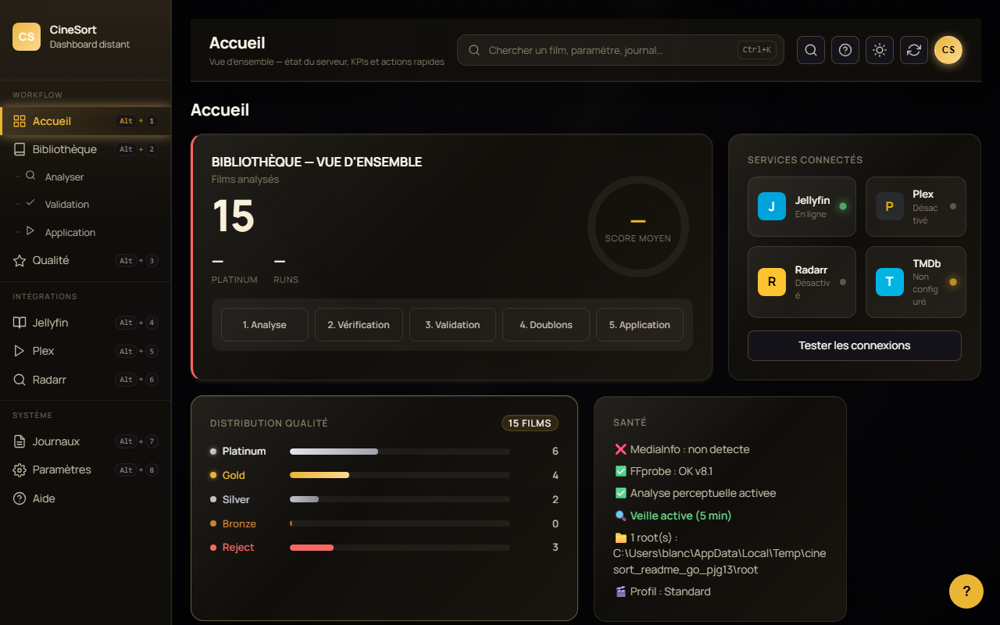
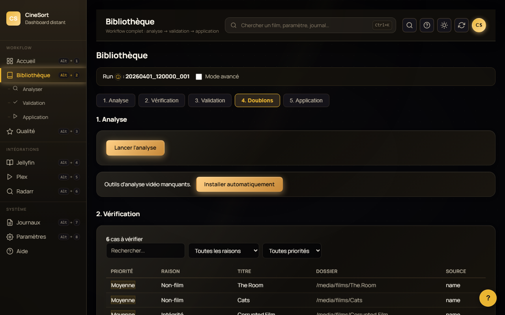
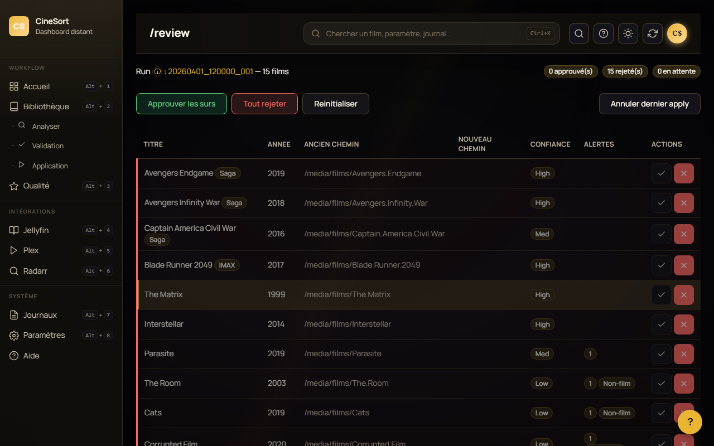
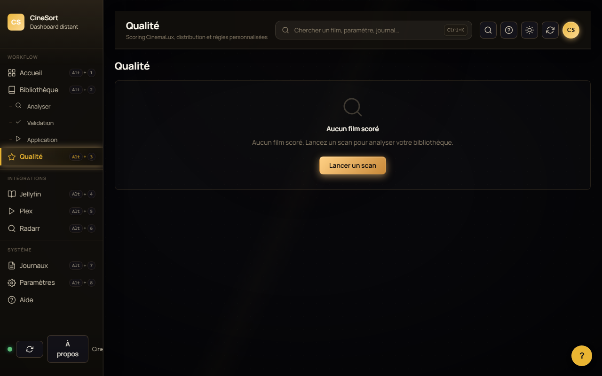
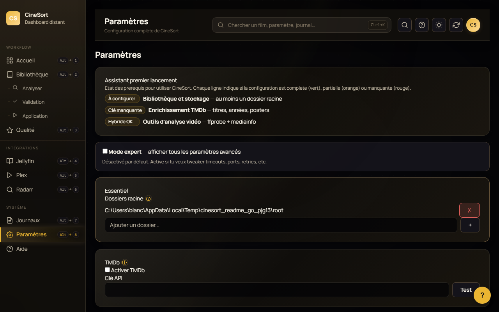
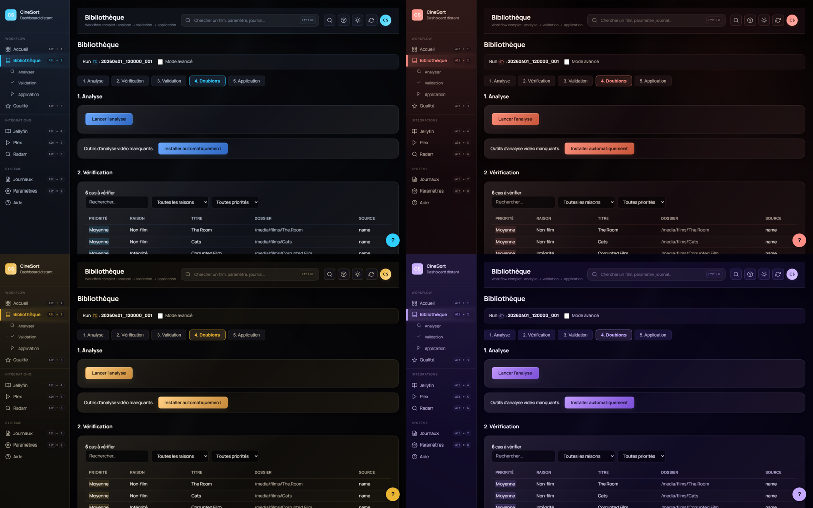

<div align="center">


# CineSort

**Le tri-renommage automatique de ta bibliothèque de films, sans prise de tête.**

[](LICENSE)


[](#statut-beta)
[](https://github.com/Thomas05000005/CineSort/actions/workflows/ci.yml)
[](https://github.com/Thomas05000005/CineSort/actions/workflows/codeql.yml)
[](https://scorecard.dev/viewer/?uri=github.com/Thomas05000005/CineSort)
[](https://codecov.io/gh/Thomas05000005/CineSort)
[](https://app.deepsource.com/gh/Thomas05000005/CineSort/)
[](#tests-et-qualité)
[](#-architecture)

> ⚠️ **v1.0.0-beta** — première publication publique. Le code est mature (~50 000 lignes, 4277 tests, audit complet, architecture en couches verrouillée), mais la beta sert à recueillir des retours sur des bibliothèques réelles avant la v1.0 stable. **Ne pas activer en production critique sans dry-run préalable.**

[Quick Start](#-quick-start) · [Fonctionnalités](#-fonctionnalités) · [Architecture](#-architecture) · [Captures](#-captures-décran) · [FAQ](#-faq) · [Contribuer](CONTRIBUTING.md)

</div>

---



## ✨ Pourquoi CineSort

- 🎬 **Renommage TMDb-aware** — détecte titre/année depuis tes fichiers même mal nommés
- 🔍 **Score qualité perceptuel** — analyse réelle vidéo (LPIPS, HDR, banding) + audio (loudness, clipping)
- 🛡️ **Zéro casse** — `dry-run` obligatoire, journal write-ahead, undo par film
- 🔌 **Intégrations natives** — Jellyfin, Plex, Radarr, TMDb (sync watched, refresh post-apply)
- 🌐 **Dashboard LAN** — accède à ta bibliothèque depuis ton téléphone via le réseau local
- 🌙 **4 thèmes** — Studio, Cinema, Luxe, Neon
- 🇫🇷 **100% francophone** — UI, doc, glossaire métier
- 🔒 **Privacy-first** — zéro télémétrie, zéro tracking, tout reste sur ton disque
- 🏗️ **Architecture stricte** — 4 couches séparées (domain/app/infra/ui), contracts vérifiés en CI

## 🚀 Quick Start

### Option 1 : Binaire (recommandé)

1. Télécharge `CineSort.exe` depuis la page Releases du repo
2. Lance — pas d'install, pas d'admin, autonome
3. Au premier démarrage, suis le wizard (5 étapes)

### Option 2 : Sources

```bash
git clone https://github.com/Thomas05000005/CineSort.git cinesort
cd cinesort
python -m venv .venv313
.venv313\Scripts\activate
pip install -r requirements.txt
python app.py
```

Prérequis : Python 3.13, Windows 10/11, WebView2 Runtime (déjà présent sur Win 11).

### Modes de lancement

```bash
python app.py                     # UI normale (production)
python app.py --dev               # Mode développeur (console visible)
python app.py --api               # API REST seule, sans UI desktop
python app.py --api --port 9000   # API REST sur port custom
```

## 📸 Captures d'écran

### Bibliothèque


### Validation


### Qualité (analyse perceptuelle)


### Paramètres


### 4 thèmes (Studio / Cinema / Luxe / Neon)


## 🎯 Fonctionnalités

### Détection et renommage
- Extraction titre/année depuis NFO, dossier, filename, TMDb (avec fallback intelligent)
- Profils de renommage (default, plex, jellyfin, quality, custom) — 20 variables
- Détection séries TV (S01E01, 1x01, "Saison N Episode N")
- Multi-root (plusieurs dossiers racine en un seul scan)
- Lookup IMDb ID depuis `.nfo` (endpoint `/find`)
- Cross-check OMDb optionnel pour les matches douteux

### Analyse qualité
- Probe ffprobe + mediainfo (résolution, codec, bitrate, audio, sous-titres)
- Score perceptuel **réel** (LPIPS ONNX, HDR10+, Dolby Vision, banding, grain v2)
- Détection upscale suspect, re-encode dégradé, faux 4K (FFT 2D)
- Comparaison qualité doublons (7 critères pondérés)
- Vérification intégrité (magic bytes MKV/MP4/AVI/TS/WMV + tail check)
- Score composite v2 (Video 60% / Audio 35% / Cohérence 5%) avec confidence-weighted scoring

### Sécurité opérations
- `dry-run` obligatoire avant tout apply
- Journal write-ahead (atomicité crash-safe, migration 019)
- Undo par film (granulaire, pas seulement par batch)
- Backup auto SQLite (avant migration + après apply, rotation 5)
- Pre-check espace disque avant apply
- Doublons SHA1 isolés, conflits vers `_review/`
- Scrubber de secrets dans les logs (8 patterns : API keys, tokens, passwords)

### Intégrations
- **TMDb** — métadonnées + posters + sagas + cross-check OMDb
- **Jellyfin** — refresh library, sync watched-state, validation cohérence
- **Plex** — refresh library, sync report
- **Radarr** — sync bidirectionnelle, propose upgrades qualité
- **Letterboxd / IMDb** — import watchlist CSV (matching fuzzy rapidfuzz)

### Interface
- 4 thèmes atmosphériques (tier colors invariantes, vérifié en CI)
- Mode débutant / expert (cache options avancées)
- Tooltips ⓘ glossaire métier (18 termes)
- Compteurs sidebar dynamiques
- Drawer mobile pour validation distante
- Raccourcis clavier complets (Alt+1-7, Ctrl+K palette, ?, Esc, etc.)
- Empty states + skeleton loaders + draft auto

## 🏗️ Architecture

CineSort suit une **architecture en couches stricte** verrouillée par [import-linter](https://github.com/seddonym/import-linter) en CI :

```
ui/      Frontend desktop (pywebview) + REST API + facades par bounded context
  ↓
app/     Orchestration (apply, scan, plan, sync Jellyfin/Plex/Radarr)
  ↓
domain/  Logique métier pure (scoring, parsing, perceptual, naming)
  ↓
infra/   I/O : SQLite WAL + Repositories, TMDb/Jellyfin/Plex/Radarr clients, REST server
```

**3 contracts CI** (`.importlinter`) :
1. `domain` ne peut pas importer `app`, `infra`, `ui`
2. `infra` ne peut pas importer `app`, `ui`
3. `app` ne peut pas importer `ui`

Toute régression bloque le merge automatiquement.

### Patterns en place
- **Repository pattern** pour SQLite : `store.probe`, `store.scan`, `store.quality`, etc. (composition > héritage MRO)
- **Strangler Fig + Facade** sur CineSortApi : 5 facades (`run`, `settings`, `quality`, `integrations`, `library`)
- **Module-style imports** pour les modules mockés en test (préserve `patch("cinesort.X.Y")`)

## 🌐 Dashboard distant

Accessible depuis tout navigateur du réseau local à `http://<ip-pc>:8642/dashboard/` après activation dans Paramètres → API REST.

- 10 vues : login, status, logs live, bibliothèque, runs, review, qualité, Jellyfin, Plex, Radarr, réglages
- Auth par Bearer token (>= 32 chars), rate limiting (5 échecs / 60s → 429)
- Polling adaptatif (2s durant un run, 15s sinon)
- HTTPS optionnel (cert+key via openssl)
- QR code dans les réglages desktop pour appairer ton téléphone
- LAN-demote automatique si bind 0.0.0.0 demandé avec token court

## 🛠️ Stack technique

- **Python 3.13** + pywebview ≥ 5.0 (desktop) + http.server stdlib (REST server)
- **SQLite WAL** (schema v21, 21 migrations idempotentes, backup auto rotation 5)
- **Dépendances applicatives** : `requests`, `rapidfuzz` (matching fuzzy), `segno` (QR code)
- **Analyse perceptuelle** : `onnxruntime` + `numpy` (LPIPS AlexNet ONNX 9.4 MB)
- **Probe vidéo** : ffprobe + mediainfo (binaires embarqués dans l'EXE)
- **Qualité** : `ruff` (lint + format), `import-linter`, `pre-commit`, `pytest` (≥ 9.0.3), `hypothesis`, `coverage` (seuil CI 80%)
- **Security** : `bandit`, `mypy`, `pip-audit`, `gitleaks`, `CodeQL`, `OpenSSF Scorecard`
- **Build** : `PyInstaller` 6.10+ (~50 MB onefile EXE Windows)

## 🧪 Tests et qualité

```bash
check_project.bat                                # CI locale : compile + lint + format + import-linter + tests + coverage
python -m pytest tests/ --timeout=60 -q          # Tests rapides (sans e2e/live)
python tests/e2e/run_e2e.py                      # E2E dashboard (Playwright)
lint-imports                                     # Verifie les 3 contracts d'architecture
```

Garanties CI bloquantes :
- **80 % de couverture** minimum
- **Lint Ruff** propre (lint + format)
- **import-linter** : 3 contracts d'architecture en couches (domain/infra/app)
- **0 régression** sur 4277 tests unitaires
- **EXE < 60 MB**
- **CodeQL + Bandit + pip-audit + gitleaks + mypy**

## ❓ FAQ

### CineSort modifie-t-il mes fichiers vidéo ?

Non. CineSort renomme/déplace les **fichiers** sur disque, mais ne ré-encode jamais le contenu vidéo/audio. Tes fichiers restent bit-pour-bit identiques (vérifiable via SHA-1).

### Mes torrents qui seedent vont-ils casser après un renommage ?

CineSort respecte la contrainte de seed par défaut : le **renommage de fichier** est désactivé pour les fichiers détectés comme partagés via un client torrent. Tu peux changer ce comportement dans Paramètres → Renommage si tu acceptes le risque.

### Comment annuler un apply raté ?

Vue **Application** → onglet **Historique** → tu peux annuler par batch ou sélectivement film par film. Le journal write-ahead permet aussi une reconciliation automatique au prochain boot si un crash a interrompu un apply.

### Mes données sont-elles envoyées quelque part ?

**Non**. CineSort fait des appels HTTP uniquement vers : TMDb (si activé), OMDb (cross-check optionnel), Jellyfin/Plex/Radarr (si configurés), GitHub Releases (si auto-check MAJ activé). Aucune télémétrie, aucun tracking, aucune analytics. Les clés API sont chiffrées avec Windows DPAPI.

### Puis-je utiliser CineSort sur Mac/Linux ?

Pas pour l'instant. Le projet cible Windows 10/11 nativement (pywebview + DPAPI + binaires ffprobe/mediainfo). Le port Linux/Mac est dans la roadmap v2.0.

### Comment configurer le dashboard distant ?

Paramètres → API REST → activer + définir un token long (≥ 32 chars). Accède au dashboard depuis ton téléphone via `http://<ip-pc>:8642/dashboard/`. Le QR code affiché dans les réglages desktop te permet d'appairer ton téléphone en un scan.

### CineSort est-il sécurisé ?

- Pas d'admin requis, sandbox Windows-friendly
- Tokens API chiffrés DPAPI (TMDb, Jellyfin, Plex, Radarr, OMDb, SMTP)
- Logs scrubbés (8 patterns de secrets jamais loggés en clair)
- Bandit + CodeQL + pip-audit + gitleaks en CI
- HTTPS optionnel pour le dashboard
- Branch protection main + 7+ status checks obligatoires
- OpenSSF Scorecard (actions externes pinnées par SHA)

### Quelle est la roadmap ?

Voir [ROADMAP.md](docs/internal/ROADMAP.md). En résumé :
- **v1.0** stable — après retours beta v1.0.0-beta
- **v1.1** — features mineures, polish UI
- **v2.0** — port Linux/Mac, i18n EN, plugin marketplace

## 🗺️ Statut des refactors architecturaux

| Initiative | Statut |
|-----------|--------|
| **Cycle `domain → app` brisé** | ✅ mai 2026 (issue #83, phases A1-A8) |
| **Architecture verrouillée en CI** | ✅ `import-linter` (3 contracts KEPT) |
| **God class CineSortApi → 5 facades** | ✅ mai 2026 (issue #84, 10 PRs Strangler Fig) |
| **Mixins SQLite → Repository pattern** | 🔶 7 Repositories en place, suppression mixins prévue (issue #85 phase B8) |
| **Logging structuré API** | ✅ 198 sites migrés (issue #103) |

## 📚 Documentation

- [CONTRIBUTING.md](CONTRIBUTING.md) — comment contribuer
- [CODE_OF_CONDUCT.md](CODE_OF_CONDUCT.md) — code de conduite (Contributor Covenant 2.1 FR)
- [SECURITY.md](SECURITY.md) — politique de sécurité + responsible disclosure
- [docs/internal/CLAUDE.md](docs/internal/CLAUDE.md) — contexte pour Claude Code (Anthropic AI)
- [docs/internal/ROADMAP.md](docs/internal/ROADMAP.md) — feuille de route v1.x / v2.0
- [CHANGELOG.md](CHANGELOG.md) — historique des versions
- [docs/internal/BILAN_CORRECTIONS.md](docs/internal/BILAN_CORRECTIONS.md) — bilan des phases d'audit

## 📄 Licence

[MIT](LICENSE) — utilise, modifie, distribue librement.

## 🙏 Crédits

- TMDb pour les métadonnées
- ffmpeg / mediainfo pour le probe vidéo
- onnxruntime pour LPIPS perceptuel
- Contributor Covenant pour le code de conduite
- Tous les early adopters qui ont testé en bêta privée 🍿

---

<div align="center">

**Tu as aimé CineSort ?** Mets une ⭐ sur le repo, partage à tes potes cinéphiles.

</div>
